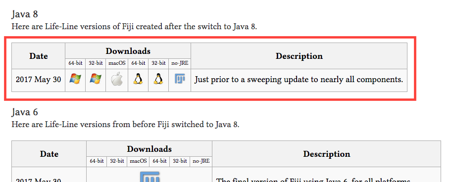

# OpenSource Optical Vulnerability (OSOV) ImageJ Scripts

## Installation

[Download the latest version](https://github.com/OpenSourceOV/imagej-scripts/archive/master.zip) and unzip.

In the ImageJ directory...

* Put the OSOV folder in the plugins directory (e.g. c:\ImageJ\plugins\OSOV)
* Put the OSOV Toolbox.ijm in the macros/toolsets folder (e.g. c:\ImageJ\macros\toolsets\OSOV Toolbox.ijm)
* Restart ImageJ

Once installed you can access the macros and plugins from the toolsets menu or the normal plugin menu (under 'OSOV'). To add the toolset to the toolbar use the More Tools icon (>>) at the far right of the toolbar (See the [ImageJ User Guide - Custom Tools](https://imagej.nih.gov/ij/docs/guide/146-20.html) for more information) and select 'OSOV Toolbox'.

## Problems

* If the Plugin > OSOV menu doesn't list a number of items then you may have issue with the version of ImageJ. This version of ImageJ from [https://imagej.net/Fiji/Downloads#Life-Line_Fiji_versions](https://imagej.net/Fiji/Downloads#Life-Line_Fiji_versions) work:

    

### Credits

All plugins developed by OpenSourceOV except for the [Stack Contrast Adjustment plugin](https://imagej.nih.gov/ij/plugins/stack-contrast/index.htm) developed by Jan Michalek, Martin Capek, Jiri Janacek.